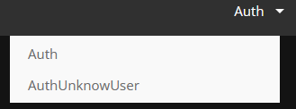

# ProjetDPisicne

Projet de Design Pattern, ayant pour but de développer une application Web avec une architecture client-serveur
pour gérer des agendas.

-----

## Équipe

* BRIOT Anthony
* MATHIEU STEINBACH Hugo
* ZIMOL Guillaume

Lien du git : https://github.com/Amaroke/ProjetDPiscine

-----

## Comment utiliser le projet

Premièrement, il faut avoir installer node.js :  
https://nodejs.org/fr/download/  

Pour installer les dépendances :
> npm install

Pour lancer le serveur, depuis la racine :  
> node ./public/js/controllers/server.js  

Accesible en localhost avec le port 8080 : http://localhost:8080/

Utile lors du dévelopment mais non nécessaire pour utiliser l'application :
- Lancer le serveur avec nodeamon (ce qui permet au serveur de se relancer à chaque modification du code) :  
> npm run start

- Lancer la commande suivante pour recréer le fichier css de l'application :  
> npm run tailwind:build

-----

## Documentation pour l'API externe

Toute la documentation détaillée est accessible facilement à ce lien :
https://documenter.getpostman.com/view/20927448/2s84DkUQs2  
Il faut penser à utiliser les petites flèches en haut à pour afficher les différents exemples, il faut cliquer sur la petite flèche en haut à droite de chacun comme ceci : 
 
Un fichier PDF est également disponible à la racine du projet (API.pdf).

--- 

## Guide d'utilisation de l'application

### La création de compte

### La connexion/déconnexion

### La consultation des évènements

#### Jour

#### Semaine

#### Mois

### La modification des évènements

### La suppression des évènements

### Précisions vis-à-vis de l'aspect du temps réel et du stockage des données