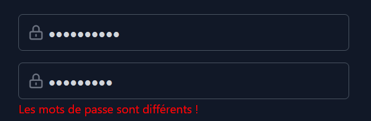

# ProjetDPiscine

Projet de Design Pattern, ayant pour but de développer une application Web avec une architecture client-serveur
pour gérer des agendas.

-----

## Équipe

* BRIOT Anthony
* MATHIEU STEINBACH Hugo
* ZIMOL Guillaume

Lien du git : https://github.com/Amaroke/ProjetDPiscine

-----

## Comment utiliser le projet

Premièrement, il faut avoir installer node.js :  
https://nodejs.org/fr/download/  

Pour installer les dépendances :
> npm install

Pour lancer le serveur, depuis la racine :  
> node ./public/js/controllers/server.js  

Accessible en localhost avec le port 8080 : http://localhost:8080/

Utile lors du dévelopment mais non nécessaire pour utiliser l'application :
- Lancer le serveur avec nodeamon (ce qui permet au serveur de se relancer à chaque modification du code) :  
> npm run start

- Lancer la commande suivante pour recréer le fichier css de l'application :  
> npm run tailwind:build

-----

## Documentation pour l'API externe

Toute la documentation détaillée est accessible facilement à ce lien :
https://documenter.getpostman.com/view/20927448/2s84DkUQs2  
Il faut penser à utiliser les petites flèches en haut à pour afficher les différents exemples, il faut cliquer sur la petite flèche en haut à droite de chacun comme ceci : 
 
Un fichier PDF est également disponible à la racine du projet (API.pdf).

--- 

## Guide d'utilisation de l'application

### La création de compte

Pour créer un compte, il faut se rendre sur là l'adresse suivante http://localhost:8080/auth, notons qu'on y est automatiquement redirigé si l'on essaye d'accéder au site sans y être préalablement connecté.  
Lors de l'inscription, il est obligatoire de renseigner un nom, un prénom, un pseudo ainsi qu'un mot de passe (qui peuvent être n'importe quoi tant qu'ils ne sont pas vides).
Autrement le site affichera des messages indiquant ce qu'il manque en rouge :
   
Il faut également saisir un mot de passe et une confirmation, les deux doivent concorder, sinon l'inscription restera impossible et le site nous indiquera l'erreur :
   
Une fois l'inscription finalisée, nous sommes automatiquement redirigés vers la page de connexion.

### La connexion/déconnexion

La connexion se déroule de la même façon que l'inscription, il s'agit tout simplement d'un formulaire à remplir, si un pseudo non enregistré est renseigné le site nous en informe :
  

Il en va de même avec un mot de passe incorrect :
   

Si les informations saisies sont correctes, l'utilisateur est redirigé vers la page principale, là où il accède à son calendrier, sur la vue par défaut, celle de la semaine (nous reviendrons sur ce point dabs la suite).
Cette page est la seule accessible une fois connecté, et elle est mise à jour en fonction des interactions de l'utilisateur, en temps réel.

Notons qu'un bouton de déconnexion est présent sur cette page et accessible à n'importe quel moment :
   

### La consultation des évènements

Une barre en haut du calendrier est présente peu importe la vue actuellement consultée, elle indique la plage des jours affichés, dispose de trois boutons permettant de se déplacer d'un jour en avant ou d'un jour en arrière, ou de retourner au jour actuel, d'une liste d'options déroulantes cliquables, qui permettent de choisir la vue désirée et qui affiche la vue actuellement consultée ainsi qu'un bouton pour ajouter des évènements que nous détaillerons par la suite :
   
Notons que seuls les évènements de la personne actuellement connectée sont affichés.

#### Jour

La vue du jour permet de consulter tous les évènements sur une journée donnée, si un évènement du jour précédent se termine dans la journée actuellement consultée alors celui-ci est affiché.
Ici l'affichage d'un évènement ayant débuté le 28 novembre :
   

#### Semaine

La vue de la semaine permet de consulter tous les évènements sur une semaine donnée, si un évènement du jour précédent se termine dans la journée suivante celui-ci est affiché comme pour la vue jour.
Ici l'affichage d'un évènement ayant débuté le 28 novembre et d'un autre d'une durée de 24h :
   

#### Mois

La vue mois est toujours sur le même fonctionnement, cependant si un évènement est sur deux jours, il n'apparaitra que sur le jour où il débute, les évènements sont affichés les uns sous les autres, une petite barre de défilement apparait s'il y en a un nombre trop conséquent le même jour. En voici un exemple, il y a 2 évènements le 3 novembre, on remarque également différentes couleurs (cela sera précisé dans la suite) :
   

### L'ajout des évènements

L'ajout d'évènement se fait simplement à l'aide de la fenêtre modale qui s'ouvre au clic sur le bouton d'ajout présent dans la barre de navigation au-dessus de chacune des vues. 
Comme pour l'inscription certains champs sont obligatoires, mais ne nécessite rien de spécial, si ce n'est que la durée d'un évènement ne peut dépasser 24h :
   
Pour la date, nous utilisons un datePicker, qui ouvre un "calendrier" fictif permettant de choisir la date plus facilement.
Cependant, la superposition d'évènement est interdite, ainsi il sera impossible de valider si l'évènement que l'on essaye de créer se superpose avec un autre.
Autrement l'évènement sera créé et l'utilisateur sera redirigé vers la vue de la semaine.

### La modification des évènements

Comme pour l'ajout, lors d'un clic sur un évènement du calendrier, une fenêtre modale s'ouvre et permet la modification de l'évènement cliqué :
   
Les informations de l'évènement sons récupérées et le formulaire est préremplie avec celles-ci, puis libre à nous de les modifier, cette fenêtre suit les mêmes règles que l'ajout d'évènements.

### La suppression des évènements

Petit détail supplémentaire, lors de l'ouverture de la fenêtre de modification d'un évènement, il est également possible de cliquer sur la petite poubelle en haut à droite de la fenêtre :
   
Cela aura pour effet de supprimer l'évènement.

### Light and Dark Theme et importance des évènements

Le site autorise d'un simple clic sur ce bouton :
    
De passer du thème sombre au thème clair de notre site.  
Comparaison des deux thèmes sur l'écran de connexion :
    
Comme remarqué précédemment les évènements ont différentes importances, cela va avec différentes couleurs dans l'affichage.

### Précisions vis-à-vis de l'aspect du temps réel et du stockage des données

Les données sont toutes stockées sans aucune sécurité dans les .json (events.json pour les évènements et users.json pour les utilisateurs). 
Pour ce qui est du temps réel, une stratégie de long-polling a été mis en place. Ainsi, si j'ai deux navigateurs ouverts, chacun connecté au même compte, et que j'ajoute un évènement sur l'un il apparaitra (après un cours délai lié au long-polling) sur le deuxième navigateur, il en va de même avec la suppression des évènements.